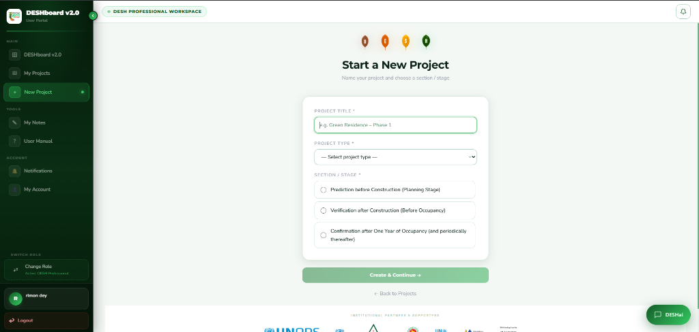
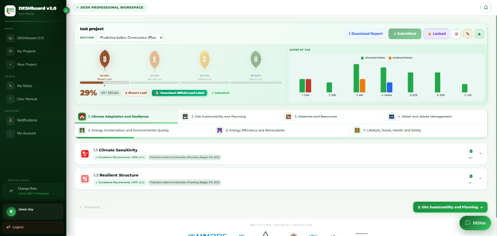
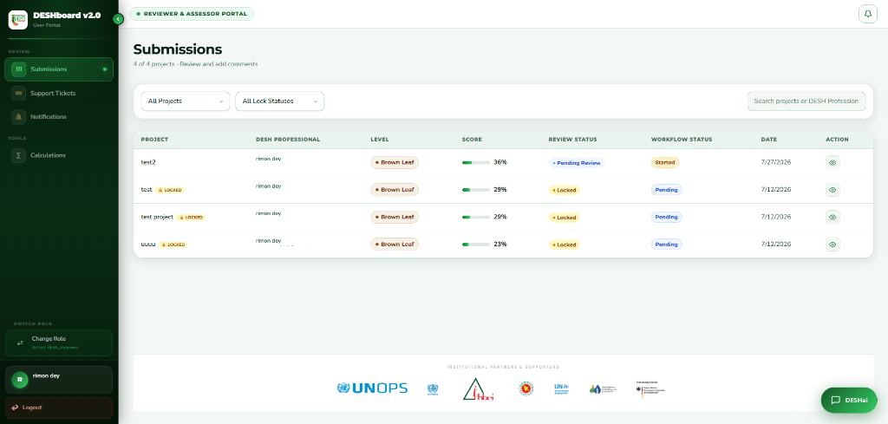
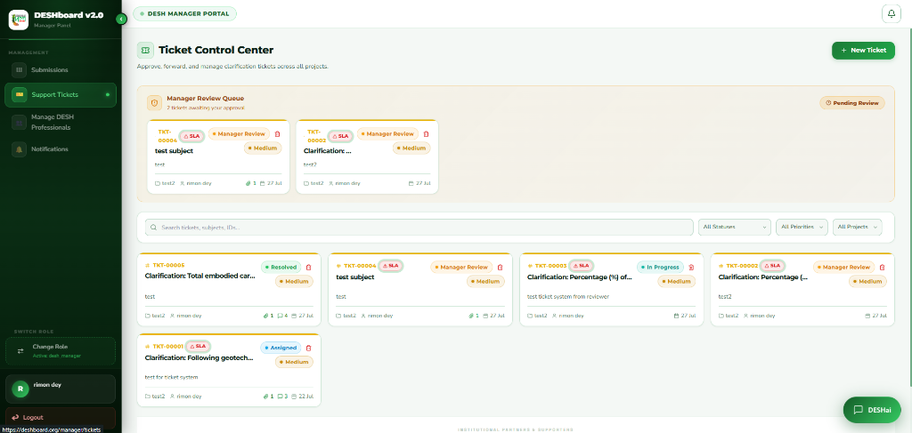
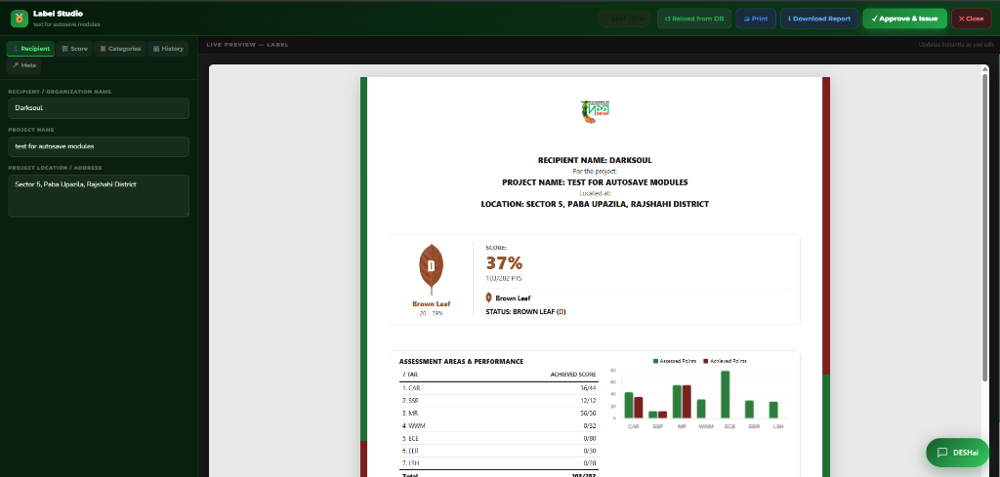

# DESHboard — Green Building Assessment & Certification Platform

> A comprehensive, modern web platform to evaluate, score, audit, and certify sustainable building projects against the DESH green building standards.

---

## 📖 Overview

Green building certification typically involves hundreds of complex environmental criteria, intricate mathematical formulas, heavy documentation, and constant back-and-forth between project developers and certifying bodies. 

**DESHboard** replaces disconnected spreadsheets and email threads with a unified, role-based digital certification platform. It supports the entire lifecycle of a green building project — from initial data collection and specialized environmental calculations to multi-stage auditor reviews, clarification ticketing, and official certificate issuance.

### Who Uses DESHboard?

The platform supports six distinct user roles with dedicated interfaces and permissions:
1. **DESH Professionals (`user`)**: Architects, engineers, and consultants who register projects, complete multi-step information forms, run calculations, upload evidence, and submit assessments.
2. **Project Owners (`owner`)**: Building owners and client collaborators with view and co-management access to project submissions.
3. **DESH Reviewers (`desh_reviewer` / `reviewer`)**: First-line technical auditors who inspect submitted documentation, verify question-level compliance, lock verified fields, and finalize evaluation pillars.
4. **DESH Assessors (`desh_assessor`)**: Senior evaluators who perform second-pass quality assurance and validation across reviewed submissions.
5. **DESH Managers (`desh_manager`)**: Operations leads who assign reviewers/assessors, manage workflow stages, review tickets, approve final scoring, and issue official certificates.
6. **System Administrators (`admin`)**: Platform administrators who manage user permissions, configure assessment criteria and calculation formulas, customize form schemas, inspect activity logs, and configure system branding.

---

## 🚀 Key Features by Module

### 1. Assessment & Real-Time Scoring Matrix
- **Hierarchical Framework**: Dynamic 4-level assessment tree (**Project Category $\rightarrow$ Assessment Tab/Pillar $\rightarrow$ Module $\rightarrow$ Section $\rightarrow$ Input Question**).
- **Flexible Scoring Logic**: Supports multiple question types including linear graph interpolation (calculating fractional points based on continuous threshold ranges), point-weighted multi-select checkboxes, and compliance-only document uploads.
- **Continuous Auto-Save**: Real-time answer persistence as users fill out assessments, with instantaneous recalculation of earned vs. maximum points and percentage progress bars.
- **Project Access & Collaboration**: Owners and professionals can invite team members and co-owners by email with granular access control.
- **Review Locking**: Automatic project locking upon submission to maintain data integrity during active audit cycles.

### 2. Reviewer & Assessor Multi-Stage Audit Workflow
- **Role-Scoped Queues**: Dedicated submission dashboards for reviewers, assessors, and managers with real-time status indicators.
- **Question-by-Question Auditing**: Timestamped verification tracking (`reviewerChecked`, `assessorChecked`) attributing audit actions to specific personnel.
- **Granular Input Locking**: Auditors can lock individual question inputs to freeze approved items while leaving others editable for user revisions.
- **Pillar Sign-Off**: Tab-level finalization requiring 100% question review before unlocking the overall submission completion state.
- **Stage Rollback Engine**: Managers can roll back a project to any earlier stage (Professional, Reviewer, or Assessor), automatically adjusting assignment states and unlocking relevant fields.

### 3. Custom Calculation Engine & Formula Modeler
- **Embedded Calc Modules**: Direct linkage from assessment questions to specialized calculation tools (e.g., energy efficiency ratings, rainwater harvesting capacity, HVAC load estimates).
- **Master Dropdown Catalogs**: Admin-managed reusable data catalogs (materials, equipment types, standard efficiency values) consumed by formula steps.
- **Step-by-Step Formula Modeler**: Dynamic section and formula builder supporting inter-variable dependencies and unit conversions.
- **Calculation Archives**: Users can execute calculations, save runs to their personal calculation archive, and automatically sync computed values back into project assessment fields.

### 4. Dynamic Form Builder & Interactive Geolocation Mapping
- **Schema-Driven Multi-Step Form**: Fully configurable project onboarding wizard (general information, site specifications, project team roster) driven by JSON schema.
- **Admin Form Builder**: Visual interface for admins to create, reorder, and customize form steps, field types, and validation rules.
- **Interactive GPS Site Mapping**: Built-in Leaflet/OpenStreetMap picker allowing users to drop a pin to capture exact coordinates, with bidirectional latitude/longitude input and automated reverse geocoding for street addresses.

### 5. Enterprise Ticket & Clarification Management System
- **Question-Linked Tickets**: Users and auditors can raise support and clarification tickets directly attached to specific assessment questions, capturing a static question snapshot at creation time.
- **Dynamic Ticket Form Schema**: Admin-customizable ticket categories, priorities (Critical, High, Medium, Low), SLA resolution targets, and dynamic field types.
- **Dual Routing Workflows**: Configurable support for both **Restricted Mode** (manager triage, approval, and assignment) and **Unrestricted Mode** (direct routing to assignees).
- **Status State Machine & Timelines**: Full lifecycle management (`Open` $\rightarrow$ `Under Review` $\rightarrow$ `Assigned` $\rightarrow$ `In Progress` $\rightarrow$ `Resolved` $\rightarrow$ `Closed` / `Returned` / `Rejected`) with threaded responses, file attachments, and visual status history timelines.
- **Ticket Analytics & Reporting**: Manager KPI summary dashboard tracking SLA metrics and CSV ticket data export.

### 6. Automated Certificate Generation & PDF Engine
- **Automated Leaf Level Tiers**: Dynamic classification into certification tiers based on final percentage score (**Brown Leaf $\ge 20\%$**, **Orange Leaf $\ge 40\%$**, **Yellow Leaf $\ge 60\%$**, **Green Leaf $\ge 80\%$**).
- **Interactive Certificate Preview**: Manager workspace to inspect score breakdowns per pillar, customize recipient details, configure historical score comparisons, and set validity dates.
- **Client-Side Vector PDF Synthesis**: High-resolution PDF generation via `jsPDF` that renders custom leaf badges, official signatures, serial numbers (`DESH-YYYY-BAN-XXXXX`), and verifiable QR codes.
- **Secure Download Distribution**: Download access controlled by manager authorization flags once issuance is approved.

### 7. Real-Time Collaboration, Discussions & Notifications
- **Threaded Discussion Streams**: Project-level collaboration threads for user-auditor communication with file attachments.
- **Anonymous Role Masking**: Built-in privacy masking that displays generic identifiers (e.g., "DESH Reviewer-1", "DESH Professional-1") to protect auditor impartiality.
- **Project Notes**: Dedicated bilateral note-taking module between project applicants and administrative staff.
- **Socket.IO Notification Center**: Real-time push notifications for ticket updates, review assignments, and status transitions with direct deep-links.

### 8. DESHai Chatbot & Live Support Console
- **Interactive Floating Assistant**: Global widget providing automated assistance across the platform.
- **Rule-Based Q&A Bot**: Admin-configured keyword matching with structured interactive button navigation paths.
- **Live Human Handover**: Automated escalation queue (`human_requested`) allowing users to transition from the bot to a real-time live support chat with platform administrators.

### 9. Knowledge Base & Resource Manual
- **Centralized Document Library**: Searchable repository of technical manuals, green building guidelines, compliance templates, and instructional videos (supporting file uploads up to 35 MB).

### 10. Administration, Audit Trails & White-Label Customization
- **Global Activity Audit Log**: Comprehensive audit trail capturing all critical system actions (logins, score changes, stage transitions, role updates, certificate approvals) with multi-filter search and CSV export.
- **Structure Import & Export**: Full CSV and JSON import/export engine to backup, restore, or migrate complete assessment frameworks (Tabs, Modules, Sections, Inputs, Evaluation Rules).
- **White-Label Branding Suite**: Dynamic configuration of site logos, authentication banners, custom portal titles, partner/sponsor footer carousels, customizable navigation labels, and route visibility toggles.

---

## 🛠️ Tech Stack

### Frontend
- **Framework & Core**: React 19, Create React App, React Router DOM 7
- **Styling & UI**: TailwindCSS 3, PostCSS, Framer Motion, Lucide React, React Icons
- **State & Real-Time**: React Context API (`AuthContext`, `NotificationContext`), Socket.IO Client
- **Authentication**: Firebase JavaScript SDK 12 (Email/Password, Google OAuth, JWT Tokens)
- **HTTP Client**: Axios (with custom auth interceptors and secure token attachment)
- **Mapping & Geolocation**: Leaflet 1.9, React-Leaflet 5, OpenStreetMap API
- **Charts & Data Visualization**: Recharts 3
- **PDF Generation**: jsPDF 4, `jspdf-autotable` 5, `html2pdf.js`
- **Form Management**: React Hook Form 7, Zod 4, `@hookform/resolvers`
- **Feedback & Alerts**: React Hot Toast, SweetAlert2

### Backend Architecture *(Private Repository)*
- **Runtime & Server**: Node.js (ESM), Express 5
- **Database & ODM**: MongoDB Atlas, Mongoose 9
- **Authentication Verification**: Firebase Admin SDK
- **Real-Time Engine**: Socket.IO 4
- **File Uploads**: Multer (disk storage with MIME validation)
- **Utilities**: QR Code generation, CSV streaming

---

## 💡 Engineering Highlights & Technical Challenges

Here are some of the most intricate technical solutions implemented across this frontend:

- **Continuous Linear Score Interpolation**: Implemented real-time mathematical interpolation ($y = y_1 + \frac{y_2 - y_1}{x_2 - x_1} \cdot (x - x_1)$) within the assessment client to evaluate fractional points dynamically across non-linear compliance thresholds without incurring server round-trips.
- **Client-Side High-DPI Vector Certificate Synthesis**: Engineered a standalone PDF generator using `jsPDF` that stitches together base64-encoded leaf badges, dynamic pillar breakdown tables, signature blocks, and programmatic QR codes into a print-ready vector document.
- **Dynamic Schema Interpreters (Forms & Calc Engines)**: Designed modular React components that parse nested JSON schemas stored in MongoDB and dynamically construct multi-step wizards, custom validation schemas, dependent dropdowns, and live formula evaluations.
- **Dual-Layer Authorization & Role Switching**: Built a flexible permission architecture in React Router v7 that decouples a user's persistent permission set (`roles[]`) from their currently active view (`activeRole`), enabling instant context switching across administrative, reviewer, and applicant portals without requiring re-authentication.
- **Bidirectional Map Synchronization**: Created a cohesive Leaflet integration that synchronizes GPS coordinates bidirectionally — typing numerical latitude/longitude coordinates adjusts the map marker in real time, while dragging the pin triggers reverse geocoding to automatically populate city and address fields.
- **WebSocket Event Mesh & Anonymized Collaboration**: Integrated Socket.IO event listeners with React state to power live notification badges, real-time support chat, and anonymized discussion boards that mask auditor identities while maintaining verifiable audit logs.

---

## 📸 Screenshots

### Multi-Step Project Creation

### DESH Professional — Assessment Workspace

### Reviewer & Assessor — Submissions Dashboard

### Manager — Ticket Control Center

### Certificate Generation & Live Preview

---

## 🔒 Security & Repository Notice

> **Note**: This repository contains the **public frontend source code only**. All backend server routes, database connection strings, Firebase service account credentials, and proprietary evaluation algorithms are maintained in a separate private repository for security and intellectual property protection.
